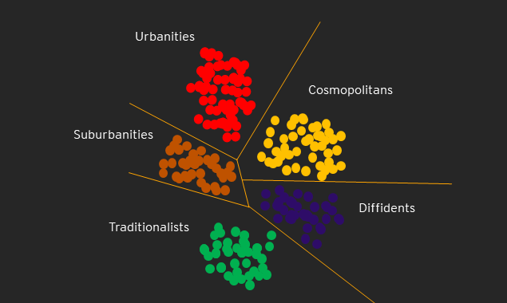

# Introduction

In today's digital world a good understanding of customers is extremely important for running a successful business. **Know your customer (KYC)** can make a huge difference in the margins of a company. It helps companies in creating, communicating and delivering their offerings by tailoring to their customer needs.
Understanding customers and their needs is not a trivial task and may include studying a wide range of customer characteristics and their behaviour and numerous outcomes and performance indicators that businesses might be interested in. One of the most fundamental marketing strategies is segmentation, targeting, and positioning. We are going to discuss Customer segmentation in more detail below.

# What is Customer Segmentation?

Customer Segmentation (CS) is fundamental to every business. CS provides insight into the landscape of the market revealing customer characteristics that can be used to group customers into segments having something in common. It is also known as *Clustering*. Based on the characteristics of each cluster it is useful to assign a meaningful name to that cluster. These labels help to summarize or characterize customers and can be used to design products, services or offers that provide innovative customer experiences. 



## Why and how to do CS analysis?

Customization makes customers happy which is great for the business and results in higher profits. The main objectives of CS analysis are listed below:

1. To tailor the product or services for each group of customers.
2. Identify the best group of customers to sell products or services.
3. Create a successful marketing campaign.
4. To generate a report of underperforming and overperforming segments.
5. To generate a new index that can be used in other ML models as a predictive variable.

Customers can be segmented using demographic (Age, Gender) or transactional information (Purchase history, Frequency) and can be analyzed with cohort analysis or by running KMeans clustering. Let us first do cohort analysis and then run KMeans clusteirng.

## What is Cohort Analysis?

It is a descriptive analytics tool. It groups customers in mutually exclusive cohorts and provides deeper insights into buying patterns. There are different types of cohorts:

1. Time cohorts - monthly, quarterly or daily
2. Behaviour cohorts
3. Size cohorts
  
Let us load the required libraries and read the Online Retail data to perform time- and behaviour-based cohort analysis. The data is derived from the [UCI repository](https://archive.ics.uci.edu/ml/datasets/Online+Retail+II).


```{r load_libraries, message=FALSE, warning=FALSE}
  library("readr")
  library("lubridate")
  library("dplyr")
  library("readxl")
  library("tidyr")
  library("DescTools")
  library("gplots")
  library("ggplot2")
  library("caret")
  library("tibble")
  library("gridExtra")
  library("purrr")

 # Function to calculate intra-cluster sum of the squares for KMeans clustering
iss <- function (k){
  km.out <- kmeans(datamart_normalized[,2:4], centers = k, nstart = 100, iter.max = 100)
  return(km.out$tot.withinss)
}
```

```{r read_file}

  data <- read_excel("C:\\Users\\khannva1\\Documents\\DS-Projects\\Customer Segmentation\\OnlineRetail.xlsx")
  
  # Lets us remove the incomplete cases 
  data <- data[complete.cases(data),]
 
```
  
```{r data_wrangling}
  # Begin the days from 01 in InvoiceMonth column
  # lubridate function parse_date_time and ymd().
  data <- data %>% mutate(InvoiceMonth = parse_date_time(paste(year(data$InvoiceDate),
                                                               month(data$InvoiceDate), sep = " "), 
                                                         orders = c("Ym")) %>% ymd())
  
# Group by Customer Id and calcuate the smallest Inovice Month (when the customer was acquired)
  temp <- data %>% group_by(CustomerID) %>% select(CustomerID, InvoiceMonth) %>% 
    summarise(CohortMonth = min(InvoiceMonth))
  
  data <- data %>% inner_join(temp, by = "CustomerID")  
  
  # Calculate how many cohorts exist
  data <- data %>% mutate(invoice_year = year(InvoiceMonth), invoice_month = month(InvoiceMonth))
  data <- data %>% mutate(cohort_year = year(CohortMonth), cohort_month = month(CohortMonth))
  
  data <- data %>% mutate(years_diff = invoice_year - cohort_year)
  data <- data %>% mutate(months_diff = invoice_month - cohort_month)
  
  data <- data %>% mutate(CohortIndex = years_diff * 12 + months_diff + 1)
```

### Time cohorts 

```{r retention, fig.width=12, fig.height=7}
  # Create the cohort table
  cohort_data <- data %>% group_by(CohortMonth,CohortIndex) %>% summarise(numCustomers = n_distinct(CustomerID))
  cohort_count <- cohort_data %>% spread(key = CohortIndex, value = numCustomers)
  
  # Calculate the retention
  cohort_sizes <- cohort_count[,2]
  # Divide the df with the row vector
  retention <- mapply('/',cohort_count[-1], cohort_count[,2]) %>%  round(3) * 100
  row.names(retention)<- cohort_count %>% pull(CohortMonth) %>% as.character()
  
  # Darw the heatmap
  colfunc <- colorRampPalette(c("#CCCCCC","#009933","#006633"))
  heatmap.2(retention, scale = "none", col = colfunc(13), trace = "none", 
            density.info = "none", Rowv = NA, Colv = NA, dendrogram = "none",
            cellnote = retention, notecol = "black", xlab = "Cohort index", 
            margins = c(8,8), sepcolor = "white", 
            main = "Customer retention", adjRow = c(11,0), srtCol = 0)

```

Let us also plot the quantity and value of goods purchased using the cohort index of customers.

```{r quantity, fig.width=12, fig.height=7} 
 
  # Let us do the same thing for Quantity column to give us an idea of how our customers are spending
  cohort_data_quantity <- data %>% group_by(CohortMonth, CohortIndex) %>% summarise(avgQuantity = mean(Quantity))
  average_quantity <- cohort_data_quantity %>% spread(key = CohortIndex, value = avgQuantity)
  average_quantity_mat <- average_quantity[,-1] %>% as.matrix() %>% round(1)
  row.names(average_quantity_mat)<- average_quantity %>% pull(CohortMonth) %>% as.character()
  
  # Draw the heatmap
  colfunc <- colorRampPalette(c("#CCCCCC","#3366CC","#0000FF"))
  heatmap.2(average_quantity_mat, scale = "none", col = colfunc(13), trace = "none", 
            density.info = "none", Rowv = NA, Colv = NA, dendrogram = "none",
            cellnote = average_quantity_mat, notecol = "black", xlab = "Cohort index", 
            margins = c(8,8), sepcolor = "white", 
            main = "Quantity of goods purchased", adjRow = c(11,0), srtCol = 0)
```

```{r unitprice, fig.width=12, fig.height=7}
# Let us do the same thing for UnitPrice column to give us an idea of how much our customers are spending
  cohort_data_unitprice <- data %>% group_by(CohortMonth, CohortIndex) %>% summarise(avgUnitPrice = mean(UnitPrice))
  average_unitprice <- cohort_data_unitprice %>% spread(key = CohortIndex, value = avgUnitPrice)
  average_unitprice_mat <- average_unitprice[,-1] %>% as.matrix() %>% round(1)
  row.names(average_unitprice_mat)<- average_unitprice %>% pull(CohortMonth) %>% as.character()
  
  # Draw the heatmap
  colfunc <- colorRampPalette(c("#FFFFC0","#FFFF66","#FFFF00"))
  heatmap.2(average_unitprice_mat, scale = "none", col = colfunc(13), trace = "none", 
            density.info = "none", Rowv = NA, Colv = NA, dendrogram = "none",
            cellnote = average_unitprice_mat, notecol = "black", xlab = "Cohort index",sepcolor = "white", 
            margins = c(8,8), main = "Value of goods purchased", adjRow = c(11,0), srtCol = 0)
```

### Behaviour based cohorts

1. Recency (R) - How recently did the customer did business with the company.
2. Frequency (F) - How many transactions the customer has done in the last 12 months. 
3. Monetary Value (M) - How much did the customer spent during the last 12 months.

We will use these metrics to assign customers into **RFM segments**. This helps analyze the behavioural patterns of our customers. For example, if we filter on *RFM segment 111* we see from the table below that **366 customers have done no transaction with the business** for quite a long time and might have churned.

```{r rfm, warning=FALSE, message=FALSE}
  
  # let us generate Spend column based on Quantity and Unit Price and 
  # snapshot date from where we want to measure the recency of purchase
  data <- data %>% mutate(Spend = Quantity * UnitPrice)
  snapshot_date <- max(data$InvoiceMonth)
 # RFM
  datamart <- data %>% group_by(CustomerID) %>% 
    mutate(MonetaryValue = sum(Spend), Recency = as.numeric(snapshot_date - max(InvoiceMonth)),
           Frequency = n()) %>% distinct(CustomerID, Recency, Frequency, MonetaryValue)
  labels <- seq(4,1)
  r_quantiles <- CutQ(datamart$Recency, breaks = quantile(datamart$Recency, 
                                           seq(0,1, by = 0.25), na.rm = TRUE), labels = labels)
  
  # Frequency and recency are considered better if higher so labels change.
  labels <- seq(1,4)
  f_quantiles <- CutQ(datamart$Frequency, breaks = quantile(datamart$Frequency, 
                                           seq(0,1, by = 0.25), na.rm = TRUE), labels = labels)
  m_quantiles <- CutQ(datamart$MonetaryValue, breaks = quantile(datamart$MonetaryValue, 
                                          seq(0,1,by = 0.25), na.rm = TRUE),labels = labels)
  
  datamart <- datamart %>% add_column(R = r_quantiles, F = f_quantiles, M = m_quantiles)
  
  # Create RFM_Segment by combining R, F and M values and RFM_Score by adding all three
  # First convert factor to the character and then to numeric.
  datamart <- datamart %>% mutate_if(is.factor, as.character) %>% 
    mutate(RFM_Segment = paste0(R,F,M)) %>%
    mutate_at(.,.vars = c('R','F','M'), as.numeric) %>% 
    mutate(RFM_Score = sum(R,F,M)) %>% ungroup()

  # Select the customers at the bottom of the RFM_Segment
  datamart %>% filter(RFM_Segment == '111')
```

We can also use *RFM Score* to calculate the summary metrics of each group. For example

```{r rfm_score}
datamart %>% group_by(RFM_Score) %>% 
  summarise(meanRecency = mean(Recency), meanFrequency = mean(Frequency), meanMV = mean(MonetaryValue), countOfCustomers = n())
```

Grouping customers based on RFM_Score gives a good picture of behavioural patterns however, it is not uncommon to group customers into even smaller groups of Gold, Silver, and Bronze and calculate the summary statistics. For example

```{r gold_silver_bronze}
datamart <- datamart %>% mutate(RFM_cluster = case_when(RFM_Score >= 9 ~ "Gold", 
                        RFM_Score >= 5 & RFM_Score < 9 ~ "Silver",
                        TRUE ~ "Bronze"))
datamart <- datamart %>% mutate(RFM_cluster = factor(RFM_cluster, levels = c("Gold", "Silver", "Bronze")))

datamart %>% group_by(RFM_cluster) %>% summarise(meanRecency = mean(Recency), meanFrequency = mean(Frequency), meanMV = mean(MonetaryValue), countOfCustomers = n())
```

# KMeans clustering

KMeans clustering algorithim works on few assumption:

1. Symmetric distribution
2. Variables with similar average values
3. Variables with similar average values

So let us check if the RFM variables follow these assumption.

```{r preprocess_kmeans}
p1 <- datamart %>% ggplot(mapping = aes(x = Recency)) + geom_histogram(aes(y = ..density..), alpha = 0.5, position = "identity", bins = 10) + geom_density(alpha = 0.2)

p2 <- datamart %>% ggplot(mapping = aes(x = Frequency)) + geom_histogram(aes(y = ..density..), alpha = 0.5, position = "identity", bins = 10) + geom_density(alpha = 0.2)

p3 <- datamart %>% ggplot(mapping = aes(x = MonetaryValue)) + geom_histogram(aes(y = ..density..), alpha = 0.5, position = "identity", bins = 10) + geom_density(alpha = 0.2)

grid.arrange(p1, p2, p3, ncol=3)
```

It seems like none of the RFM variables follow the assumptions. Let us transform the data and manage the skew. Since the log only works with positive values so let us remove any negative values from *MonetaryValue* variable. We will also **log transform and standardize the variables** for KMeans clustering.

```{r transform}
datamart <- datamart %>% filter(MonetaryValue > 0, Recency > 0, Frequency > 0)
#datamart <- datamart %>% mutate(MonetaryValue = MonetaryValue + 1, Recency = Recency + 1, Frequency = Frequency + 1)
datamart_forkmeans <- datamart %>% select(CustomerID, Recency, Frequency, MonetaryValue, RFM_Score, RFM_Segment) %>% mutate(CustomerID = as.character(CustomerID))

# Let us take log of the variables
datamart_log <- datamart_forkmeans %>% mutate(Recency = log(Recency), Frequency = log(Frequency), MonetaryValue = log(MonetaryValue))

# Let us center and scale the log transformed variables
pre_process <- datamart_log %>%  preProcess(., method = c("center","scale"))
datamart_normalized <- predict(pre_process, newdata = datamart_log)

p1 <- datamart_normalized %>% ggplot(mapping = aes(x = Recency)) + geom_histogram(aes(y = ..density..), alpha = 0.5, position = "identity", bins = 10) + geom_density(alpha = 0.2)

p2 <- datamart_normalized %>% ggplot(mapping = aes(x = Frequency)) + geom_histogram(aes(y = ..density..), alpha = 0.5, position = "identity", bins = 10) + geom_density(alpha = 0.2)

p3 <- datamart_normalized %>% ggplot(mapping = aes(x = MonetaryValue)) + geom_histogram(aes(y = ..density..), alpha = 0.5, position = "identity", bins = 10) + geom_density(alpha = 0.2)

grid.arrange(p1, p2, p3, ncol=3)
```

Let us calculate the clusters based on KMeans technique and analyze the average RFM values of each cluster. we can also compare the clusters created using RFM and KMeans technique.
```{r kmeans_test, message=FALSE, warning=FALSE}
# lets find number of optimum clusters using elbow method try 1 to 15 k values
k.values <- 1:15

wss_values <- map_dbl(k.values, iss)

plot(k.values, wss_values, type = "b",pch = 19,  
     xlab = "Number of Clusters", 
     ylab = "Within groups sum of squares",
     main = "Scree plot to find number of optimum clusters")

```

```{r kmeans_final}
# It looks like 3 or 4 could be the optimum values to form clusters. Let us use 4
Clusters <- kmeans(datamart_normalized[,2:4], 4, nstart = 20, iter.max = 50)
# Let us compare the clusters
p1 <- table(Clusters$cluster, datamart$RFM_cluster) %>% as.data.frame() %>% ggplot(aes(x = Var1, y = Freq)) + geom_bar(stat = "identity") + facet_wrap(~Var2) + xlab("KMeans clusters") + ylab("Number of customers") + ggtitle("Comparision of RFM clusters with KMeans clusters")

p2 <- datamart_normalized %>% ggplot(aes(x = Recency, y = Frequency, size = MonetaryValue , col = as.factor(Clusters$cluster))) + geom_jitter(width = 0.5, height = 0.5) + ggtitle("KMeans clusters")


grid.arrange(p1, p2, nrow = 2)
# Let us also calculate average RFM values of KMeans clusters

datamart <- datamart %>% mutate(kmeans_clusters = Clusters$cluster)

datamart %>% group_by(kmeans_clusters) %>% summarise(mean_recency = mean(Recency), mean_frequency = mean(Frequency), mean_mv = mean(MonetaryValue), countOfCustomers = n())


```

# Conclusion

Clustering analysis is a powerful tool in marketing analytics. It is used to find a group of customers that share similar characteristics. This is very useful in tailoring the advertisements to a particular group of customers as there is much more unlabelled data readily available than cleanly labeled data. 
From the analysis above we see **kmeans_cluster_4 and kmeans_cluster_2 customers correspond to Gold and Bronze** classification quite well. In the Silver group, we find there are two types of kmeans_clusters i.e 1 and 3. It looks like **kmeans_cluster_1 customers spend a good amount of money, however, for unknown reasons have not done transaction** for quite a long period now so, the business can launch a targeted marketing campaign to win back these group of customers. 